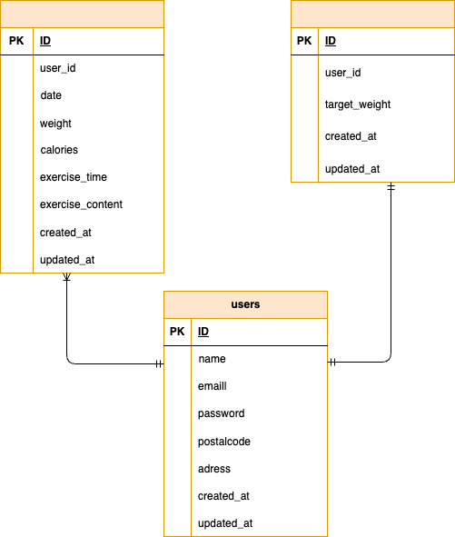

## アプリケーション名
```
coachtechフリマ
```
## 環境構築
```
Dockerビルド

　1.リポジトリからダウンロード
　　$git clone　git@github.com:kuri6-kara/miyazakiharuka-mockcase1-.git
　2.dockerコンテナを構築
　　$docker-compose up -d --build

Laravel環境構築
　
　1.Laravelをインストール
　　$docker-compose exec php bash
　　　> composer install
　2.srcディレクトリにある「.env.example」をコピーして 「.env」を作成しDBの設定を変更
　　$cp .env.example .env
　　　DB_HOST=mysql
　　　DB_DATABASE=laravel_db
　　　DB_USERNAME=laravel_user
　　　DB_PASSWORD=laravel_pass
　3.アプリケーションキーを作成
　　　> php artisan key:generate
　4.DBのテーブルを作成
　　　> php artisan migrate
　5.DBのテーブルにダミーデータを投入
　　　> php artisan db:seed
　6."The stream or file could not be opened"エラーが発生した場合
　　srcディレクトリにあるstorageディレクトリ以下の権限を変更
　　$ chmod -R 777 storage
```

##　使用技術
```
　・PHP 8.4.1
　・Laravel 8.83.8
　・mysql 8.0.26
```

## ER図
　

##　URL
```
開発環境

　・お問い合わせ画面：http://localhost/
　・ユーザー登録：http://localhost/register
　・phpMyAdmin：http://localhost:8080/
```

