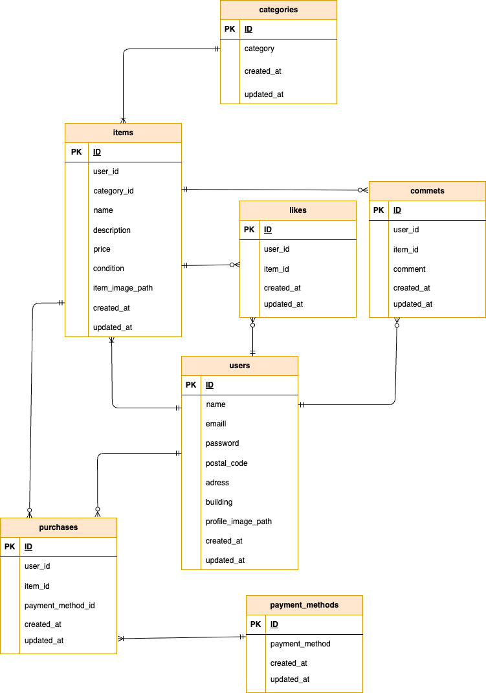

## アプリケーション名

```
coachtechフリマ
```

## 環境構築

```
Dockerビルド

　1.リポジトリからダウンロード
　　$git clone git@github.com:kuri6-kara/miyazakiharuka-mockcase1-.git
　2.dockerコンテナを構築
　　$docker-compose up -d --build

Laravel環境構築
　
　1.Laravelをインストール
　　$docker-compose exec php bash
　　　> composer install
　2.srcディレクトリにある「.env.example」をコピーして 「.env」を作成しDBの設定を変更
　　$cp .env.example .env
　　　DB_HOST=mysql
　　　DB_DATABASE=laravel_db
　　　DB_USERNAME=laravel_user
　　　DB_PASSWORD=laravel_pass
　3.アプリケーションキーを作成
　　　> php artisan key:generate
　4.DBのテーブルを作成
　　　> php artisan migrate
　5.DBのテーブルにダミーデータを投入
　　　> php artisan db:seed
　6."The stream or file could not be opened"エラーが発生した場合
　　srcディレクトリにあるstorageディレクトリ以下の権限を変更
　　$ chmod -R 777 storage
　7. 画像アップロード用シンボリックリンクの作成
   アップロードした画像をWebから参照できるように、storageへのシンボリックリンクを作成します。
   > php artisan storage:link

テスト環境の構築と実行

　テスト用に新しいデータベースを作成し、テストを実行します

   1. テスト用データベースの作成
      $ docker-compose exec mysql bash
      > mysql -u root -p
      mysql> CREATE DATABASE demo_test;

      ※mysqlのrootユーザのログインパスワードは「root」

   2.テスト用の.env.testingファイルの作成

      APP_ENV=test
      APP_KEY=
      DB_DATABASE=demo_test
      DB_USERNAME=root
      $ DB_PASSWORD=root

   3. テスト用のテーブルの作成
      $ docker-compose exec php bash
      > php artisan key:generate --env=testing
      > php artisan migrate --env=testing

   4. テストの実行
      > php artisan test
```

## 特記事項

```
 ・商品一覧画面の「いいね」ボタンのアイコンは当初星マークだったので、星型アイコン使用しています。

 ・ItemRequest のバリデーションルールで、「0 円以上」とあったが、クライアントと検討した結果「100 円以上」へ変更した。

 ・テストユーザ
    下記ユーザでログインして確認お願いします
      メールアドレス：test@example.com
      パスワード：password
```


## 使用技術

```
　・PHP 8.4.1
　・Laravel 8.83.8
　・mysql 8.0.26
```

## ER 図



## URL

```
開発環境

　・ログイン：http://localhost/login
　・会員登録：http://localhost/register
　・フリマアプリトップ画面：http://localhost/
　・phpMyAdmin：http://localhost:8080/
```
